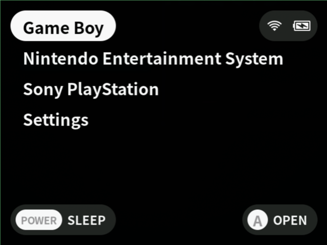
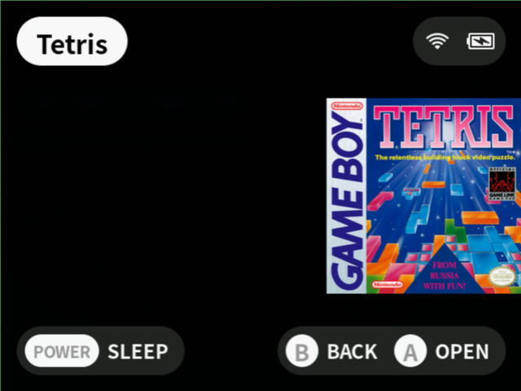
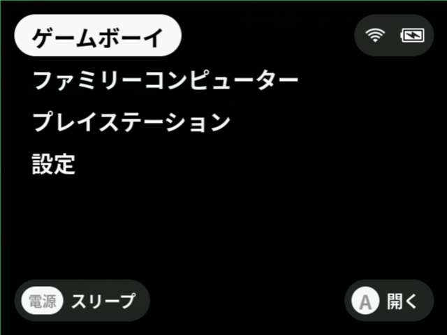
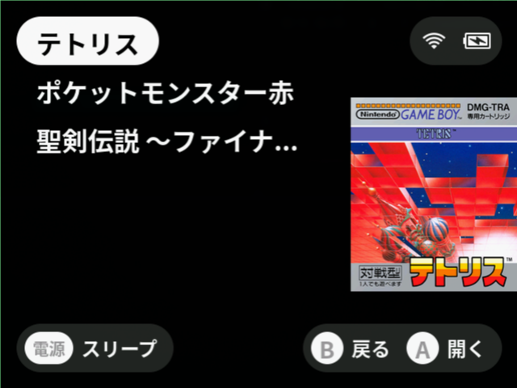

# OneOS

OneOS is a retro game launcher and libretro frontend. It is a fork of [MinUI](https://github.com/shauninman/MinUI) with added support for CJK (Japanese, Simplified/Traditional Chinese, Korean) as well as French and Spanish.

## Screenshots

English UI:

| Launcher | Game selected |
| -- | -- |
|  |  |

Japanese UI (multi-byte ROM names render correctly):

| Launcher | Game selected |
| -- | -- |
|  |  |

## Features

- Simple launcher, simple SD card layout
- No configuration
- Multi-byte ROM file names display correctly
- Multi-language UI, including CJK
- Auto sleep after 30 seconds; hold POWER to sleep / wake
- Resumes from the previous running state on power on

## Supported languages

- English
- Japanese
- Chinese (Simplified and Traditional)
- Korean
- French
- Spanish

## Supported consoles

- NES / Famicom
- SNES / Super Famicom
- Game Boy
- Game Boy Color
- Game Boy Advance
- Sega Genesis / Mega Drive
- PC Engine / TurboGrafx-16
- Sony PlayStation

## Supported devices

### Tested by maintainer

- Miyoo Mini Plus

### In codebase, untested by maintainer

| Device | Platform |
| -- | -- |
| Miyoo Mini / Miyoo Mini Flip | `miyoomini` (single build, model detected at runtime) |
| Miyoo Flip | `my355` |
| Miyoo A30 | `my282` |
| Anbernic RG35XX Plus / H / 2024 / SP, RG34XX, RG CubeXX | `rg35xxplus` (single build, model detected at runtime) |
| Anbernic RG35XX (older model) | `rg35xx` |
| Anbernic M17 | `m17` |
| Trimui Smart | `trimuismart` |
| Trimui Smart Pro / Brick | `tg5040` |
| Powkiddy RGB30 | `rgb30` |
| MagicX XU Mini M | `magicmini` |
| MagicX Mini Zero 28 | `zero28` |
| GKD Pixel | `gkdpixel` |

### Planned

- Anbernic RG 28XX

## License

OneOS inherits MinUI's license. The bundled fonts in the `NotoSansCJK*` family are distributed under the SIL Open Font License (OFL) 1.1.
