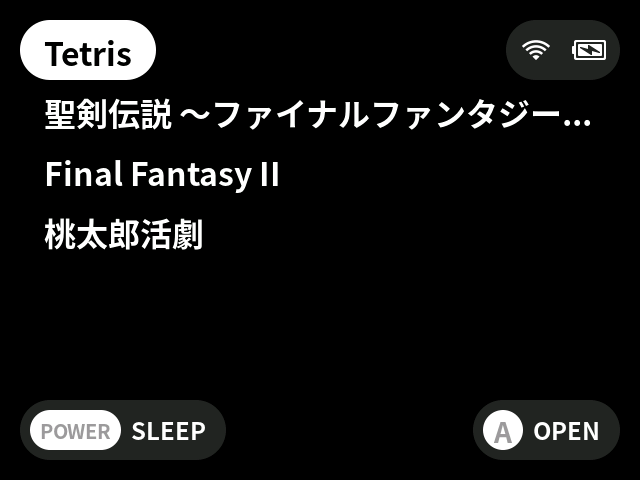
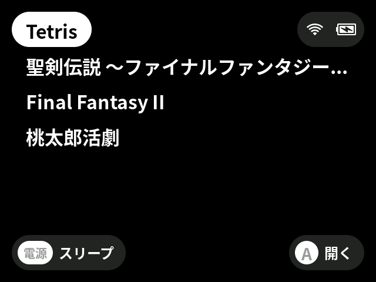
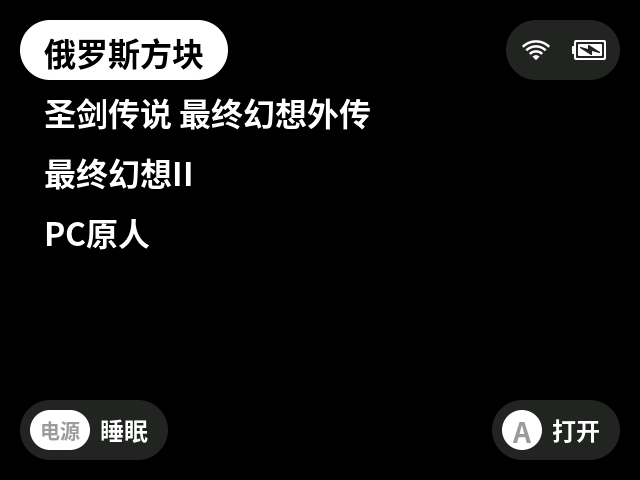

Game Focus Mode shows only the games listed in a dedicated collection.

This is useful when you want the launcher to show a small, intentional set of games instead of the full SD card library.

## Screenshots

| English | Japanese | Simplified Chinese |
| --- | --- | --- |
|  |  |  |

## Enabling Game Focus Mode

Create this file on the SD card:

```text
/Collections/Selection.txt
```

When `Selection.txt` exists, UnuOS enters Game Focus Mode automatically.

The file uses the same format as a normal collection: one absolute SD card path per line.

```text
/Roms/Game Boy (GB)/Tetris.gb
/Roms/Game Boy (GB)/Final Fantasy Adventure.gb
/Roms/Nintendo Entertainment System (FC)/Final Fantasy II.nes
/Roms/PC Engine (PCE)/Bonk's Adventure.pce
```

## What Changes

While `Selection.txt` exists, the launcher root shows only the valid games listed in that file.

The following entries are hidden:

- Recently Played
- Collections
- Tools
- Settings
- System folders

## Disabling Game Focus Mode

Delete or rename `Selection.txt`.

Example:

```text
/Collections/.Selection.txt
```

After `Selection.txt` no longer exists, UnuOS returns to the normal launcher root.

## Notes

- Empty lines are ignored.
- Missing or incorrect paths are skipped.
- If `Selection.txt` exists but contains no valid games, UnuOS shows the normal `Empty folder` message, matching an empty collection.
- Game order follows the order in `Selection.txt`.
